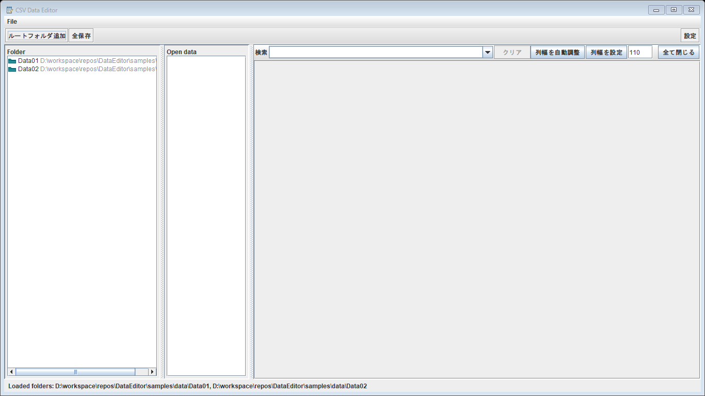
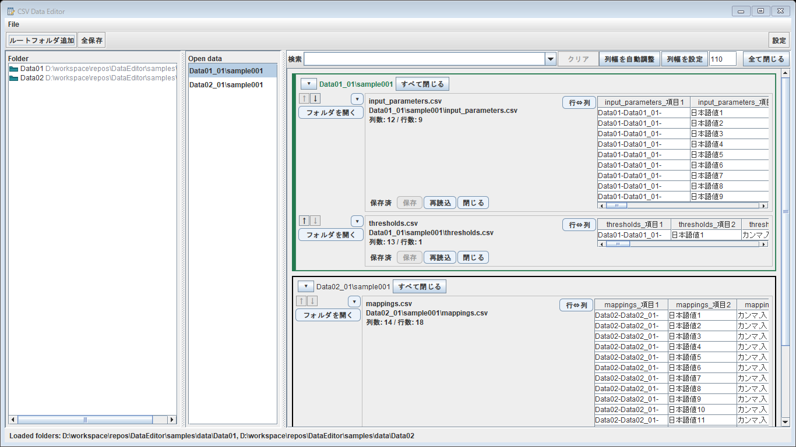
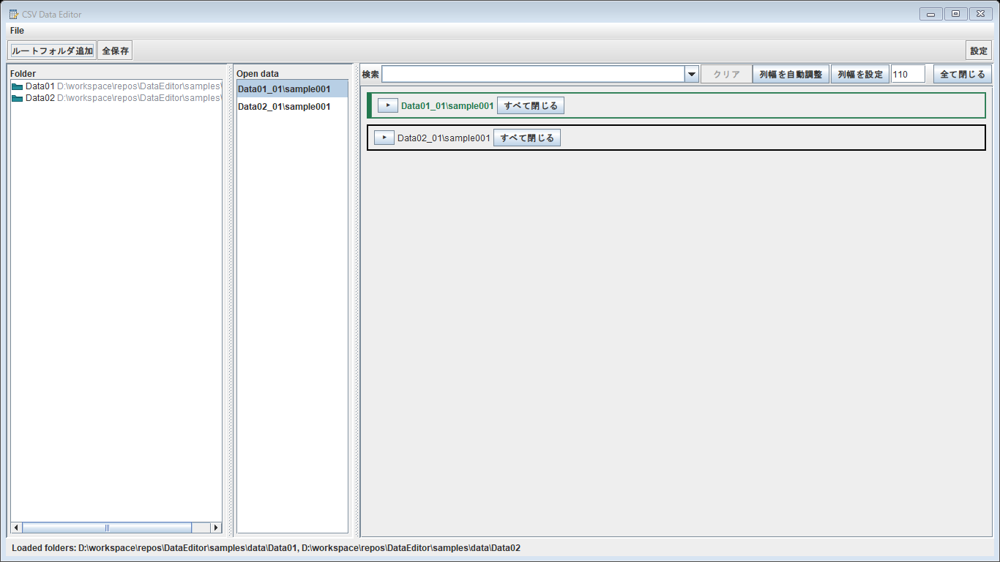
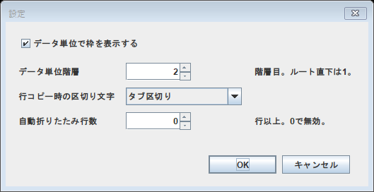

# 画面キャプチャ付き説明書

## 概要

CSV Data Editor は、フォルダー配下の CSV ファイルをデータグループ単位で開き、確認・編集・保存するためのデスクトップアプリです。
XML、テキスト、バイナリなど CSV 以外のファイルは読み込み対象外です。

この説明書の画面は、アプリを自動起動し、サンプルフォルダーを読み込んだ状態から自動キャプチャしたものです。

## フォルダーを読み込んだ画面

左側の `Folder` には、追加したルートフォルダーが表示されます。
中央の `Open data` には、開いているデータグループの一覧が表示されます。
右側は CSV パネルを表示する編集エリアです。

ルートフォルダーは、上部の `ルートフォルダ追加` から追加します。
複数のルートフォルダーを追加すると、左側にまとめて表示されます。

## 上部ツールバーのボタン

`ルートフォルダ追加` は、CSV を探すルートフォルダーを追加します。
複数フォルダーを選択すると、左側の `Folder` にまとめて表示されます。

`全保存` は、開いている CSV の変更をまとめて保存します。
未変更の CSV はそのままです。

`設定` は、データ単位表示、コピー区切り、自動折りたたみ行数、データ単位階層を変更する設定画面を開きます。

## 検索バーのボタン

検索欄は、開いている CSV パネルを CSV ファイル名で絞り込みます。
検索欄の候補には、開いている CSV ファイル名が表示されます。

`クリア` は、検索欄の入力を消して絞り込みを解除します。

`全て折りたたむ` は、開いている各 CSV パネルの中身をまとめて折りたたみます。
データグループ自体は閉じません。

`全て展開` は、折りたたまれている各 CSV パネルの中身をまとめて展開します。

`グループを全て折りたたむ` は、表示中のデータグループをまとめて折りたたみます。
各データグループ見出しだけを残したいときに使います。

`グループを全て展開` は、折りたたまれているデータグループをまとめて展開します。

`列幅を自動調整` は、表示中の CSV テーブルの列幅をセル値に合わせて自動調整します。

`列幅を設定` は、右側の数値欄に入力した幅を表示中の CSV テーブルへ適用します。

`全データを閉じる` は、開いている CSV パネルをすべて閉じます。
未保存の変更がある場合は、保存するか、破棄するか、キャンセルするかを選択します。

## CSV を開いた画面

CSV ファイルを開くと、右側に CSV パネルが追加されます。
同じデータグループの CSV は、同じグループ枠の中に並びます。

CSV パネルでは、列数・行数、ファイル名、相対パス、表データを確認できます。
`保存` は変更内容を保存します。
`再読込` はファイルを読み直します。
`閉じる` は対象の CSV パネルを閉じます。
`フォルダを開く` は CSV の格納フォルダーを開きます。

CSV パネル左側の `↑` と `↓` は、同じデータグループ内で CSV パネルの表示順を移動します。
移動できない位置では無効になります。

CSV パネル左側の `▾` または `▸` は、その CSV パネルを折りたたみ、または展開します。

`行⇔列` は、テーブルの行表示と列表示を入れ替えます。
横長の CSV を確認しやすくしたいときに使います。

## データグループの操作

データグループ見出しの折りたたみボタンで、グループ単位に表示を折りたためます。
データグループ見出しの `▾` または `▸` は、そのデータグループだけを折りたたみ、または展開します。
データグループ見出しの `すべて閉じる` は、そのデータグループ内の CSV パネルだけを閉じます。

上部ツールバーの `グループを全て折りたたむ` と `グループを全て展開` では、開いているデータグループ全体をまとめて操作できます。

`全て折りたたむ` と `全て展開` は、データグループではなく、各 CSV パネルの中身を対象にします。
`全データを閉じる` は右端にあり、開いている CSV パネルをまとめて閉じます。

## 右クリックメニュー

左側の `Folder` でフォルダーを右クリックすると、フォルダー配下の操作メニューを開けます。
`ツリーを展開` は、選択フォルダー配下をツリー上で展開します。
`配下のファイルを全て開く` は、選択フォルダー配下の CSV をまとめて開きます。
実行時に、ツリーを展開して開くか、展開せずに開くか、処理をキャンセルするかを選択できます。
`ルートフォルダーの登録を解除` は、登録済みのルートフォルダーを一覧から外します。

左側の `Folder` で CSV ファイルを右クリックすると、`ファイル名をコピー` を使えます。

CSV テーブル上で右クリックすると、セルや行の操作メニューを開けます。
`セルの値をコピー` は、選択セルの値をコピーします。
`空白行挿入` は、選択位置に空白行を挿入します。
`行コピー` は、選択行をコピーします。
`コピー行貼付け` は、コピー済みの行を貼り付けます。
`コピー行を挿入` は、コピー済みの行を選択位置へ挿入します。
`行削除` は、選択行を削除します。
`ファイル名をコピー` と `絶対パスをコピー` は、対象 CSV の情報をコピーします。

## 設定画面

上部ツールバーの `設定` から設定画面を開けます。

`データ単位表示` では、データグループ単位の表示を有効または無効にできます。
`行コピー区切り` では、コピー時の区切り文字を選択できます。
`自動折りたたみ行数` では、指定行数以上の CSV を開いたときに自動で折りたたむ条件を設定できます。
`データ単位階層` では、ルートフォルダーから何階層目をデータグループとして扱うかを指定できます。

`OK` は、設定内容を保存して画面へ反映します。
`キャンセル` は、変更を保存せずに設定画面を閉じます。

## 自動画面キャプチャについて

このアプリは Swing アプリのため、ブラウザー用のスクリーンショットではなく、Java 側から画面コンポーネントを画像として描画してキャプチャできます。
今回の説明書では、サンプルデータを読み込む一時ハーネスを使い、以下の画面を自動生成しました。

- フォルダー読み込み後の画面。
- CSV を複数開いた画面。
- データグループを折りたたんだ画面。
- 設定画面。
